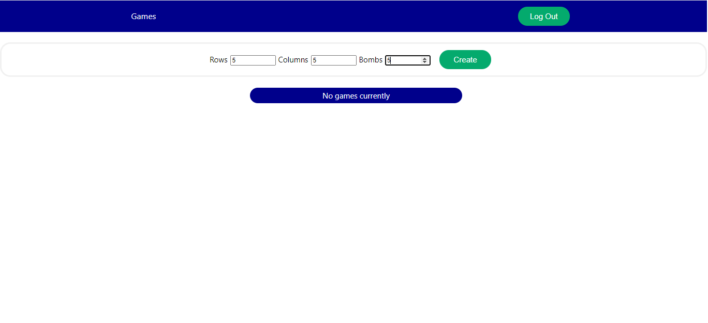

# Minesweeper React UI

This is a UI built in React 17 for playing MineSweeper consuming the Rest API [Minesweeper](https://github.com/jiujitsuboy/Minesweeper-API).

Minesweeper is a classic game that consist of a board of n*m cells and a number of bombs hidden. The purpose of the games is to open all the
cells that don't contain a bomb and optionally mark those cells with a flag.

## Features

* You can create as many users as you want.
* Every user can create and play their own custom games.
* Leave a starting game and resume when ever you want.
* Review the status of your games and even see the board after game is over.
* Mark cells with flags.

### Game Won
If you open all non bombs cell, **YOU WIN**

### Game Lost
If you open a cell that contains a bomb, **YOU LOOSE**.


### Game Already played
You can see your previous games to review how was the result.


### Flag cells
Guide by the numbers each open cell you have, you can figure out which cells can contain a bomb. Just mark it with a flag so you dont forget where the bomb is.


## How to play

1. Run the Rest API using this instructions in it repository [Minesweeper](https://github.com/jiujitsuboy/Minesweeper-API).
2. Run the React UI using the following commands:
   ```
       npm install     -->(install all the modules dependencies of the app)
       npm start       -->(start the react server and run the app)
   ```
3. Register in the game using the SignUp option.
       
4. Log in using the Signin option.
   
5. From the user's dashboard, create as many new games you want by customize the board with the rows, cells and bombs you desired. (board max size is 10*10 and 100 bombs).
   
6. Play the created board or leave and resume it when ever you want.
   
7. Using the user's dashboard you can resume games or review the game results.
    
8. Enjoy it :satisfied: